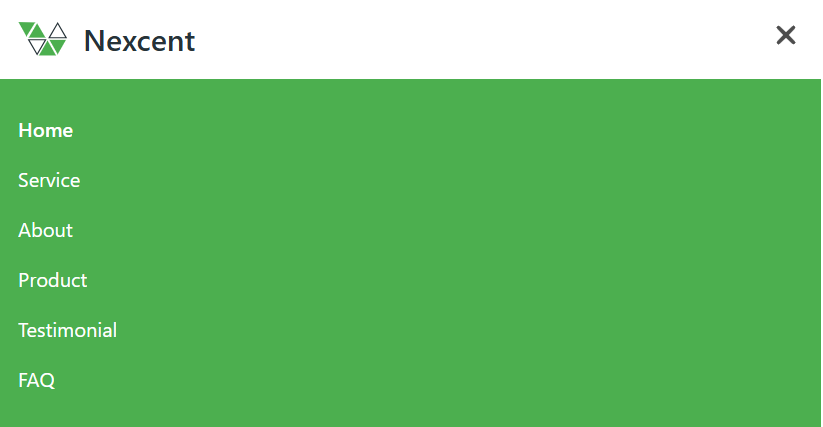
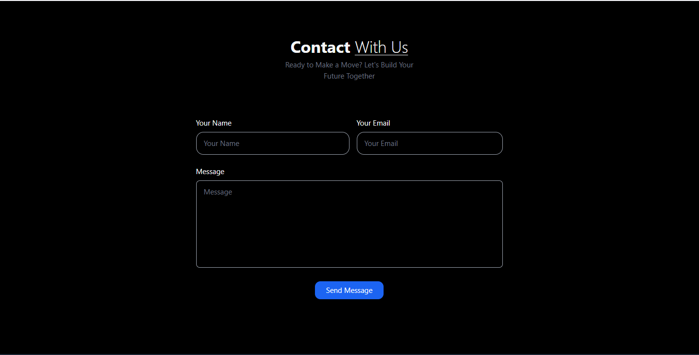
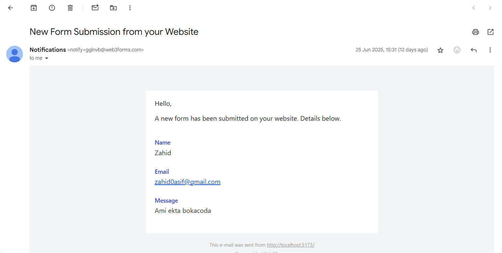
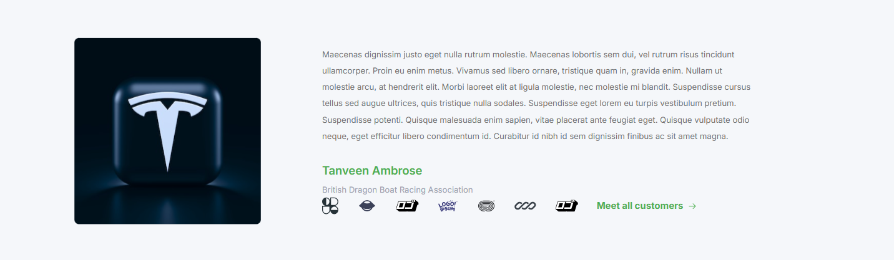
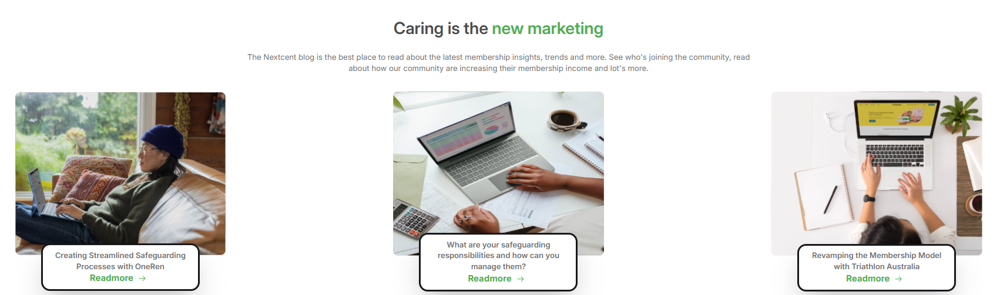

<html>
<head>
<tittle><h1>These are the previews of my website</h1></tittle>
</head>
<body>
<h3>Navigation bar in different screen-size :</h3>

 
<h3>This is the footer :</h3>
 
<h3>Carousel :</h3>
 
<h3>About Page :</h3>
 
   
<h3>Demo :</h3>
 
<h3>Contact page with working Gmail </h3>

 
<h3>Users :</h3>
 
<h3>Products :</h3>
 
<h3>Clients :</h3>
 
<h3>Blogs :</h3>
 
</body>
</html>
